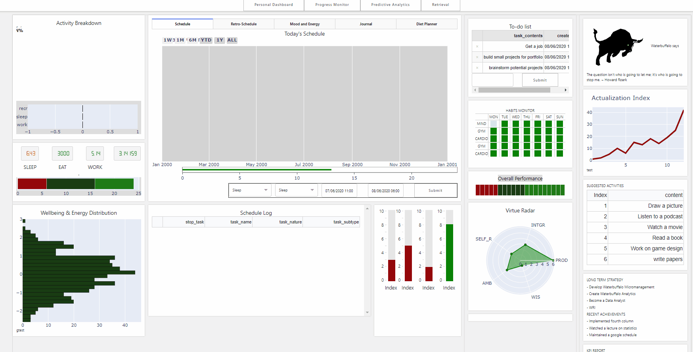

# Waterbuffalo Micromanagement

Waterbuffalo Micromanagement is a highly interactive pandas/SQL-driven dashboard that is designed to work primarily as a productivity application with the expressed aim of producing actionable feedback and insight through the analysis of personal data. Personal statistics such as wellbeing distributions, activity breakdowns and virtue-adherence are monitored, alongside more practical dynamic gantt-charts which I can use to structure my day. The end goal is to be able to identify causal structures of human flourishing through the use of data analysis, and to enforce positive behaviour using CBT-based strategies.

This project can be summarized as an attempt to solve a very important question: 
- Time Allocation: 
  -	How should I structure my days to maximise wellbeing?
    - Should I be working on this project? 
    - Should I be applying for new jobs? 
    - Should I spend all of my time at home playing video games? 
- Event/Activity Analysis:
  -	What percentage of my day is leisure, work and commitment?
  - How does the distribution of wellbeing/energy look like?
  - What is the average amount of time slept/calories consumed/hours worked a day?
  
- Data Science
  - How do specific activities/events/people contribute to my overall wellbeing?
  - Whats the optimal amount of time I should allocate to specific activities? 
  - What activities/events are associated with productive days
  - How does the past affect the future (e.g. how do past activities/events affect future wellbeing)
  - How does reading/calorie counting/meditation/workout affect my wellbeing?

Schedule Structure:
-	How should I structure my days to maximise wellbeing?

The question of time allocation needs to be solved in four parts, namely organization, reinforcement, cataloguing and insight production.

Organization:
I have attempted to categorize all of life's unique experiences into 7 distinct categories: Sleep, Work, Study, Exercise, Routine, Recreation and Indulgence.

1. **Sleep**: Approximately one third of a human life is in this unconcious state. It is indivisible.
2. **Work**: This encompasses all activities with a high potential either life maintenance or revenue generation. Can roughly be subdivided into three meaningful categories: domestic, paid and job hunting. 
3. **Study**: These are self-improvement activities designed to expand my knowledge and skillset. Examples would be programming, lectures and reading.
4. **Exercise**: Exercise is a long-term investment designed to add value to the daily activities of existing, including improved energy, vigour and wellbeing. Cardio, Resistance, Yoga, Sports etc.
5. **Routine**: Mandatory breaks for breakfast lunch and dinner, commuting
6. **Recreation**: Travel, unique, high value or novel experiences 
7. **Indulgence**: Games, Movies, Music etc

To answer this question requires some methodology to quantify wellbeing. The quantification strategy in this instance requires inferring wellbeing from the journal entries using a sentiment analysis

